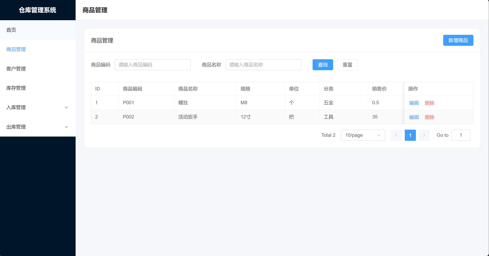
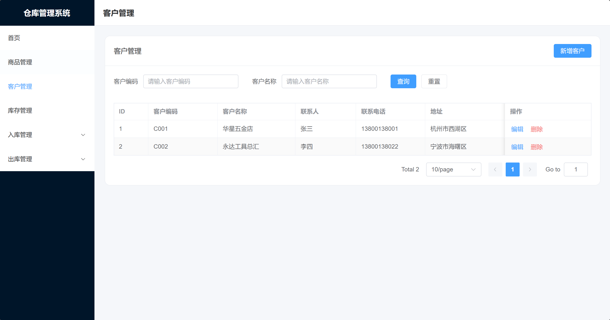
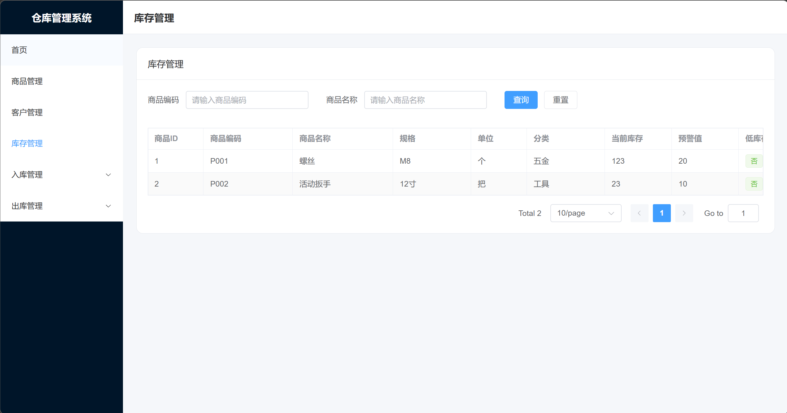
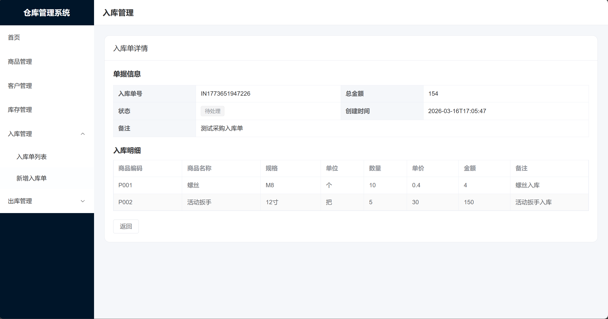
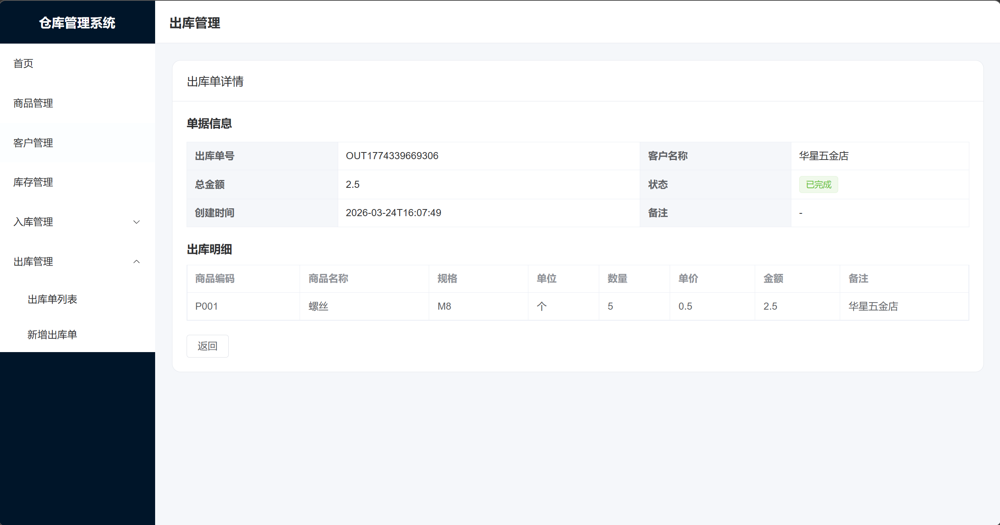

# 仓库管理系统（Warehouse Management System）

基于 **Spring Boot + MyBatis + MySQL + Vue3 + Element Plus** 开发的前后端分离仓库管理系统。

本项目围绕 **商品管理、客户管理、库存管理、入库管理、出库管理** 五个核心模块展开，已完成仓库业务的主流程闭环：

- 商品与客户基础资料维护
- 入库单录入并自动增加库存
- 出库单录入并自动扣减库存
- 库存列表与低库存状态展示
- 入库/出库单详情查看
- 多个主要列表页分页查询

> 当前版本已完成主业务闭环，适合作为 Java 校招 / 前后端分离项目展示。
---

## 一、项目简介

本项目是一个面向中小型业务场景的仓库管理系统，主要用于管理商品基础信息、客户信息、库存数据以及入库/出库单据。

当前版本已经完成以下核心能力：

- 商品管理 CRUD
- 客户管理 CRUD
- 库存列表与低库存展示
- 入库单新增、列表、详情
- 出库单新增、列表、详情
- 入库后库存自动增加
- 出库后库存自动减少
- 多个主要列表页分页查询
- 后台管理布局与菜单导航

---

## 二、技术栈

### 后端
- Spring Boot
- MyBatis
- MySQL
- Maven

### 前端
- Vue 3
- Vite
- Element Plus
- Axios
- Vue Router

### 开发工具
- IntelliJ IDEA
- VS Code / WebStorm（前端可选）
- GitHub Desktop
- Postman / 浏览器调试工具

---

## 三、功能模块

### 1. 商品管理
- 商品列表查询
- 商品新增
- 商品编辑
- 商品删除
- 商品列表分页

### 2. 客户管理
- 客户列表查询
- 客户新增
- 客户编辑
- 客户删除
- 客户列表分页

### 3. 库存管理
- 库存列表查询
- 当前库存展示
- 预警值展示
- 低库存状态展示
- 库存列表分页

### 4. 入库管理
- 入库单列表
- 新增入库单
- 入库单详情
- 入库后库存自动增加
- 入库列表分页

### 5. 出库管理
- 出库单列表
- 新增出库单
- 出库单详情
- 出库后库存自动减少
- 出库列表分页

---

## 四、核心业务亮点

### 1. 入库与库存联动
新增入库单后，系统会自动更新对应商品库存，库存列表页可直接看到库存增加结果。

### 2. 出库与库存联动
新增出库单后，系统会自动扣减对应商品库存，库存列表页可直接看到库存减少结果。

### 3. 单据详情展示
入库单与出库单均支持查看详情，能够展示单头信息与商品明细。

### 4. 前后端分离实现
后端负责业务逻辑、数据持久化与库存联动；前端负责列表查询、表单录入、详情展示与交互反馈。

### 5. 多模块统一风格
商品、客户、库存、入库、出库等主要页面统一采用后台管理布局与分页模式，界面风格一致。

---

## 五、项目结构

### 后端结构（示例）
```text
src/main/java/com/.../
├── controller
├── service
├── mapper
├── dto
├── vo
├── entity
└── common
````

### 前端结构（示例）

```text
frontend/src/
├── api
├── views
│   ├── product
│   ├── customer
│   ├── stock
│   ├── inbound
│   └── outbound
├── layouts
├── router
└── components
```

---

## 六、已完成页面

* 首页
* 商品列表页 / 新增页 / 编辑页
* 客户列表页 / 新增页 / 编辑页
* 库存列表页
* 入库列表页 / 新增页 / 详情页
* 出库列表页 / 新增页 / 详情页

---

## 七、接口说明（部分）

### 商品模块

* `GET /product/list`
* `POST /product/add`
* `PUT /product/update`
* `DELETE /product/delete/{id}`

### 客户模块

* `GET /customer/list`
* `POST /customer/add`
* `PUT /customer/update`
* `DELETE /customer/delete/{id}`

### 库存模块

* `GET /stock/list`

### 入库模块

* `GET /inbound-order/list`
* `POST /inbound-order/add`
* `GET /inbound-order/detail/{id}`

### 出库模块

* `GET /outbound-order/list`
* `POST /outbound-order/add`
* `GET /outbound-order/{id}`

---

## 八、启动方式

### 1. 后端启动

#### 环境准备

* JDK 17
* Maven
* MySQL

#### 配置数据库

修改后端配置文件中的数据库连接信息，例如：

```yaml
spring:
  datasource:
    url: jdbc:mysql://localhost:3306/warehouse_management_system?useUnicode=true&characterEncoding=utf-8&serverTimezone=Asia/Shanghai
    username: root
    password: 你的数据库密码
```

#### 启动项目

在 IDEA 中运行 Spring Boot 主启动类，或使用 Maven 启动。

---

### 2. 前端启动

进入前端目录：

```bash
cd frontend
npm install
npm run dev
```

启动后访问：

```text
http://localhost:5173
```

---

## 九、数据库说明

项目使用 MySQL 作为数据库。
请先创建数据库，并导入项目对应的表结构 SQL。

如果仓库中已有 SQL 文件，可在 README 中补充实际路径，例如：

```text
sql/wms.sql
```

如后续补充测试数据脚本，也可增加：

```text
sql/wms_demo_data.sql
```
本地开发请复制 `src/main/resources/application-local.example.yml` 为 `application-local.yml`，并填写自己的数据库账号与密码。  
`application-local.yml` 不应提交到 GitHub。
---

## 十、页面展示

这里建议在仓库中补充页面截图，并在 README 中展示，例如：

* 商品管理页
* 客户管理页
* 库存管理页
* 入库单详情页
* 出库单详情页

示例写法：


## 页面截图

### 商品管理


### 客户管理


### 库存管理


### 入库详情


### 出库详情



---

## 十一、当前完成度

### 已完成

* 商品、客户基础资料管理
* 库存展示与预警信息展示
* 入库单新增、列表、详情
* 出库单新增、列表、详情
* 入库/出库与库存联动
* 主要列表页分页
* 菜单导航与后台布局

### 待完善

* 登录鉴权
* 数据导出
* 报表统计
* 入库单/出库单编辑与删除
* 更精细的菜单状态控制
* 更完整的异常提示与边界处理

---

## 十二、项目亮点总结

本项目已完成仓库管理系统的核心业务闭环，重点体现了以下能力：

* 能独立完成前后端分离项目开发
* 能基于业务场景设计商品、客户、库存、单据等模块
* 能实现入库/出库与库存联动的业务逻辑
* 能使用 Vue3 + Element Plus 完成后台管理系统页面开发
* 能完成从接口联调到页面展示的完整开发流程

---

## 十三、后续规划

后续计划继续完善以下内容：

* 登录与权限控制
* 报表统计与图表展示
* 单据编辑/删除能力
* Excel 导入导出
* 更完善的前端交互细节
* README 与项目文档进一步完善

---

## 十四、适用方向

该项目适合作为：

* Java 后端校招项目
* 前后端分离练手项目
* 仓储/进销存方向业务系统原型
* 简历项目展示与面试演示项目

